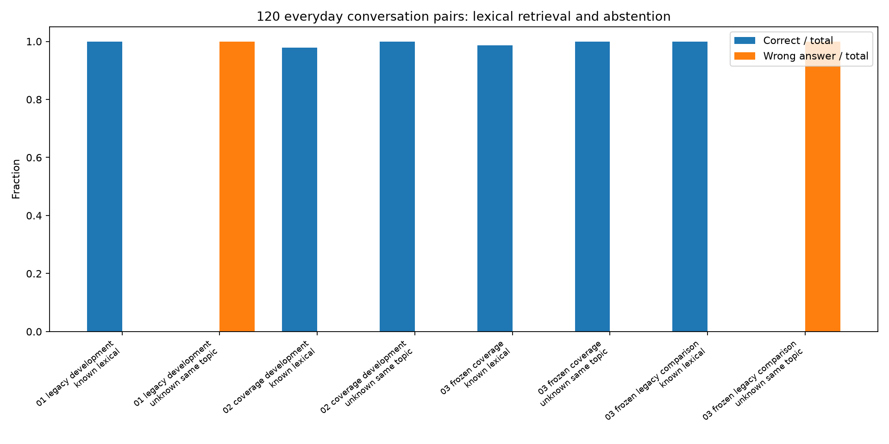
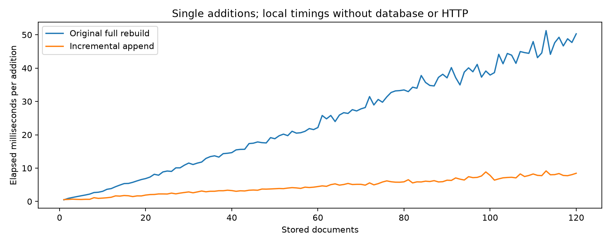

# 120 Alltagspaare im zentralen Gesprächsspeicher

120 vollständig neue, handgeschriebene Paare aus Gesprächsanlass und Antwort, verteilt auf 12 Alltagsthemen. Der aktive Korpus enthält ausschließlich diese Gesprächspaare.
60 Entwicklungsfragen, 84 zurückgehaltene Fragen und 20 Stressfragen liegen separat und werden nicht als Antworttexte importiert.
Die festen Regeln wurden vor der Holdout-Auswertung eingefroren; keine Modellgewichte und keine Synonymlisten aus den Antworten gelernt.
Die alte Implementierung erhält für den fairen Vergleich dieselben gespeicherten Anlassprompts als FFT-Schlüssel. Ihre Suchregeln und Antwortwellen bleiben unverändert. Der Adapter ist im Experimentcode ausgewiesen.
Der frühere Faktenbenchmark wird zusätzlich isoliert geprüft und gehört weder zum aktiven Gesprächsspeicher noch zu den 120 Dialogpaaren. Die überholte Betriebsnotizen-Runde liegt nur unter superseded/.

| Iteration | Split | Gruppe | Richtig | Enthalten | Falsche Antworten |
|---|---|---|---:|---:|---:|
| 01_legacy_development | development | known_lexical | 48/48 | 0 | 0 |
| 01_legacy_development | development | unknown_same_topic | 0/12 | 0 | 12 |
| 02_coverage_development | development | known_lexical | 47/48 | 1 | 0 |
| 02_coverage_development | development | unknown_same_topic | 12/12 | 12 | 0 |
| 03_frozen_coverage | holdout | known_lexical | 71/72 | 1 | 0 |
| 03_frozen_coverage | holdout | unknown_same_topic | 12/12 | 12 | 0 |
| 03_frozen_coverage | stress | semantic_no_overlap | 0/14 | 14 | 0 |
| 03_frozen_coverage | stress | unknown | 6/6 | 6 | 0 |
| 03_frozen_legacy_comparison | holdout | known_lexical | 72/72 | 0 | 0 |
| 03_frozen_legacy_comparison | holdout | unknown_same_topic | 0/12 | 0 | 12 |
| 03_frozen_legacy_comparison | stress | semantic_no_overlap | 0/14 | 10 | 4 |
| 03_frozen_legacy_comparison | stress | unknown | 4/6 | 4 | 2 |
| 03_separate_facts_regression_coverage | legacy_regression | legacy_known | 26/32 | 6 | 0 |
| 03_separate_facts_regression_coverage | legacy_regression | legacy_null | 9/9 | 9 | 0 |
| 03_separate_facts_regression_coverage | legacy_regression | legacy_semantic_no_overlap | 0/8 | 8 | 0 |
| 03_separate_facts_regression_legacy | legacy_regression | legacy_known | 31/32 | 0 | 1 |
| 03_separate_facts_regression_legacy | legacy_regression | legacy_null | 5/9 | 5 | 4 |
| 03_separate_facts_regression_legacy | legacy_regression | legacy_semantic_no_overlap | 0/8 | 8 | 0 |

## Inkrementeller numerischer Lauf

Alle 120 einzelnen Ergänzungen waren sofort auslesbar; alte Nutzdatenobjekte und alte Schlüsselkoeffizienten blieben unverändert.
964 exakte Text-Rückrechnungen bei vier Zeiten bis 1e12 s; 48/48 phasenstabile Antworten; 4 unabhängige Rückrechnungen aus vollständigen Ortsgittern.
Maximaler Koeffizientenfehler: 2.22e-16; Differenz Wellenkorrelation gegen direktes Skalarprodukt: 8.88e-16.
Gesamtdauer für 120 Änderungen: alter Komplettaufbau 2902.1 ms, inkrementell 547.0 ms.
Median: Ergänzung 4.50 ms, Abfrage 1.25 ms, vollständige Schwingungsberechnung mit Anzeigeverdichtung 5.28 ms.
Zeitmessungen sind lokale Einzelmessungen im laufenden Entwicklungssystem, keine universellen Leistungszusagen. Datenbank-I/O und HTTP kommen im separaten Live-Abnahmetest hinzu.

## Interpretation und Grenzen

Die Fourierkorrelation stimmt numerisch mit einem direkten Ähnlichkeitsskalarprodukt überein. Der Nutzen ist verlustfreier Wellenspeicher plus nachvollziehbare Suche, kein Nachweis zusätzlichen Sprachverständnisses durch Schwingungen.
Abdeckung und feste Wortnormalisierung können falsche Themenantworten reduzieren, zugleich aber belegte Fragen zurückweisen. Die Fehlertabelle enthält auch solche Rückschritte.
Die bekannten Fragen verwenden weitgehend dieselben Wörter wie die gespeicherten Gesprächsanlässe. Die Stressfragen ohne Wortüberlappung prüfen ausdrücklich die Grenze dieses Verfahrens. Ein Treffer in dieser Gruppe kann zufällig sein und belegt keine allgemeine Semantik.
Die 120 Antworttexte sind handgeschriebene Gesprächsbeispiele. Die Ergebnisse prüfen das Auswählen passender Antworten, keine freie Textgenerierung und kein über mehrere Gesprächsschritte anhaltendes Kontextverständnis.

## Fehler im eingefrorenen Lauf

- `chat-120-known` (holdout): Tschüss und bis bald. Erwartet `chat-120`, erhalten `None`.
- `stress-01` (stress): Servus! Erwartet `chat-001`, erhalten `None`.
- `stress-02` (stress): Die Augen fallen mir zu. Erwartet `chat-012`, erhalten `None`.
- `stress-03` (stress): Alles erscheint grau und schwer. Erwartet `chat-013`, erhalten `None`.
- `stress-04` (stress): Der Akku ist restlos voll. Erwartet `chat-014`, erhalten `None`.
- `stress-05` (stress): Ein Gang durchs Grüne wäre nett. Erwartet `chat-023`, erhalten `None`.
- `stress-06` (stress): Die Konzentration streikt. Erwartet `chat-034`, erhalten `None`.
- `stress-07` (stress): Verwandte fehlen. Erwartet `chat-052`, erhalten `None`.
- `stress-08` (stress): Niemand scheint für mich erreichbar. Erwartet `chat-094`, erhalten `None`.
- `stress-09` (stress): Herzlichen Dank fürs Lauschen. Erwartet `chat-082`, erhalten `None`.
- `stress-10` (stress): Ab ins Bett! Erwartet `chat-112`, erhalten `None`.
- `stress-11` (stress): Lebe wohl! Erwartet `chat-111`, erhalten `None`.
- `stress-12` (stress): Ein wenig Ermutigung wäre schön. Erwartet `chat-100`, erhalten `None`.
- `stress-13` (stress): Hurra, eine erfreuliche Botschaft! Erwartet `chat-101`, erhalten `None`.
- `stress-14` (stress): Lass uns einen Themenwechsel machen. Erwartet `chat-114`, erhalten `None`.
